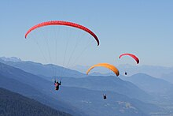

<h1>Jaw-P-project</h1>
<h2>Just another weather prediction</h2>
<h2>by <a href="https://github.com/Elenya92">Elena Battiston</a>, <a href="https://github.com/FloFriebel">Florence Friebel</a>, <a href="https://github.com/jjaehne">Jessica Jähne</a>, <a href="https://github.com/VinceZeni">Vincenzo Zeni</a></h2>

<h2>What's it all about:</h2> 
Föhn is an alpine weather phenomenon and a paraglider's hassle. 

 
A simple defenition:

Föhn is defined as a sudden gust of wind created by pressure difference on both sides of the alpine range.
Paragliding is a weather-dependent outdoor sport. To do it in safe conditions, we prefer the pressure difference not exceeding 4 hPa between the north and south sides of the Alps.

With this project, we aim to give a display of conditions between two locations paired with locations on the other side of the alpine range.
To keep it simple, we decided to provide a forecast of 3 hours from an API request.
The chosen locations are Zurich-Lugano and Innsbruck-Bolzano, where Zurich and Innsbruck are located north of the alpine range, and Bolzano and Lugano are in the south.

<h2>Data source </h2>
By using the Free API from <a href="https://open-meteo.com/en/terms">open-meteo</a> for non-commercial use, we are thankful to open-meteo for their 1000 free API calls per day. And we could use their great work for our project because the provided data structure is amazing, making the use straightforward.
We utilized the open-meteo website for educational purposes and furthered our understanding of Timeseries, Back-end, Docker, and Frontend, building upon our existing knowledge.

<h2>Method</h2>
For this <em>timeseries</em> project we wanted to test different prediction possibilities. Therefore, we used the <em>Darts</em> library, testing different models. Starting with <em>BlockRNN</em> and <em>Transformer</em> <em>Model</em>, finally trained with the <em>TFT</em>-<em>Model</em>. We checked for <em>unscaled</em> <em>data</em> and in the end chose <em>MinMax-Scaler</em>. We evaluted the prediction using <em>SMAPE</em>, which was not really convincing, and used <em>MAE</em> metrics at the End. 
The <em>Streamlit</em>-FrontEnd was based on an API created with <em>FastApi</em> and <em>DockerImages</em>. The setup was deployed to <em>Google</em> <em>Cloud</em>.
The model has been trained for one year of Data, because we got not better results for 10 years.  

The <em>features</em> are: 
| Variable           | Valid time         | Unit | Description                                                                         |
| :---               |     :---:          |:---: | :---                                                                                |
| temperature_2m     | Instant            | °C   | Air temperature at 2 meters above ground                                            |
| wind_speed_10m     | Instant            | km/h | Wind speed at 10 meters above ground. Wind speed on 10 meters is the standard level.|
| wind_direction_10m | Instant            | °    | Wind direction at 10 meters above ground                                            |
| wind_gusts_10m     | Preceding hour max | km/h | Gusts at 10 meters above ground as a maximum of the preceding hour.                 |

 
The <em>target</em> is: 

| Variable         | Valid time | Unit | Description                                                                         |
| :---             |     :---:  |:---: | :---                                                                                |
| surface_pressure | Instant    | hPa  | Atmospheric air pressure reduced to mean sea level or pressure at surface. Typically pressure on mean sea level is used in meteorology. Surface pressure gets lower with increasing elevation.|

<h2>Licence and Contributing</h2>
API will be switched of because of GCP running costs!

<h2>Acknowledgements</h2>
Thank you to leWagon TAs for batch #1601 for helping us!
